# Pages

Financial Insights has seven pages, accessible via the sidebar (desktop/tablet) or the bottom navigation bar (phone). All pages work fully offline — no server or AI credentials are needed to browse your transaction data.

---

## Layout

The app uses a responsive layout with two navigation modes:

- **Desktop / tablet** — fixed left sidebar (220 px) with icon + label links, user info and a settings icon at the bottom.
- **Phone** — collapsible top bar with a bottom navigation row (Dashboard · Transactions · Monthly · Categories · AI).

A persistent light/dark theme toggle sits in the top-right corner on all viewports. A floating chat bubble in the bottom-right opens the AI Advisor slide-in panel from any page.

| Desktop | Tablet | Phone |
|---|---|---|
| 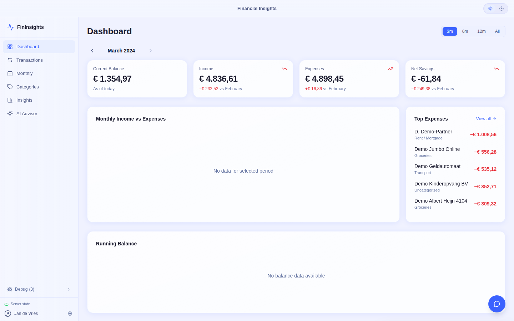 | 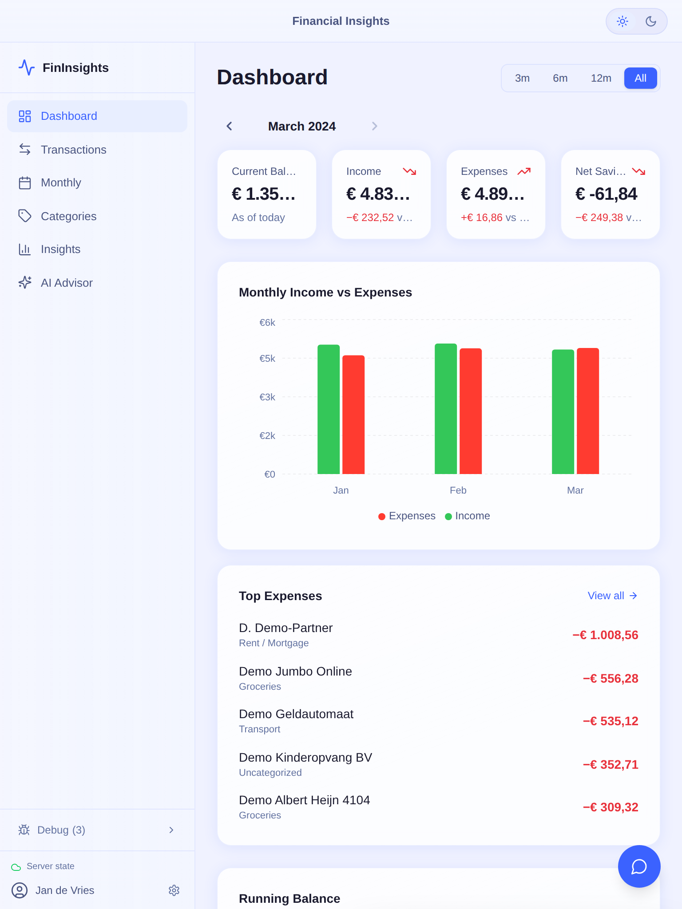 | 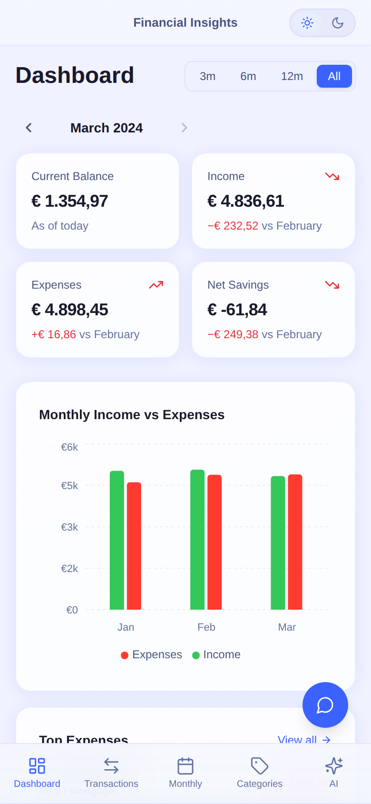 |

---

## Dashboard

**Route:** `/`

The central overview of your financial health for a selected calendar month, with range-scoped charts.

### KPI cards
Four headline numbers at the top:
- **Current Balance** — combined `balanceAfter` of the most recent transaction per IBAN.
- **Income** — sum of income transactions in the selected month.
- **Expenses** — sum of expense transactions in the selected month.
- **Net Savings** — Income − Expenses for the month.

Each card shows a trend arrow and delta vs. the previous available month.

### Month navigator
`< March 2024 >` — scroll through months that have at least one transaction. Defaults to the most recent month.

### Range selector
`3m · 6m · 12m · All` — controls the time window for the bar chart and running balance line chart (not the KPI month).

### Monthly Income vs Expenses chart
Grouped bar chart (income green, expenses red) for each month in the selected range.

### Top Expenses panel
Top 5 counterparties by total spend for the selected month, with the most frequent category as a sub-label.

### Running Balance chart
Smooth line chart showing the combined running balance across all IBANs over the selected range.

### Spaarpotjes widget
Shown only when savings goals are configured — displays the current balance for each goal.

| Desktop | Tablet | Phone |
|---|---|---|
|  |  |  |

---

## Transactions

**Route:** `/transactions`

Full transaction table with search, filtering, and inline actions.

### Filters
- **Search** — substring match on counterparty name or description.
- **From / To** — date range pickers.
- **Category** — single-select dropdown (all built-in and custom categories).
- **Type** — In / Out / All.
- **Min € / Max €** — amount range.
- **Show hidden** — toggle to include excluded transactions.
- **Flagged only** — toggle to show only flagged transactions.

### Summary row
Showing N transactions · Total in · Total out · Net.

### Table columns
Date · Counterparty · Description · Amount · Category · Balance after.
Rows are sorted by date descending by default; all columns are sortable.

### Row actions (hover)
- Change category via dropdown.
- Flag / unflag.
- Hide / unhide (excluded transactions are greyed out and do not appear in any totals or charts).

| Desktop | Tablet | Phone |
|---|---|---|
| 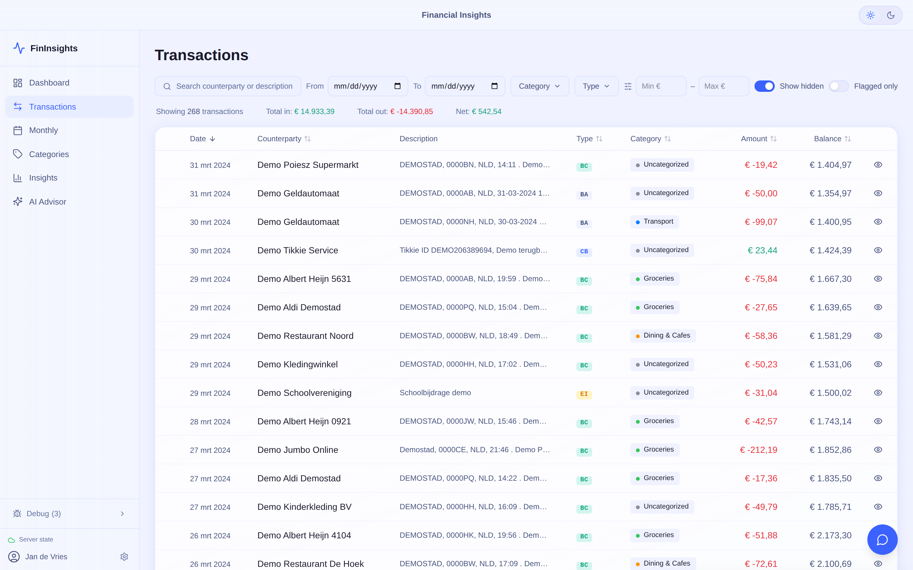 | 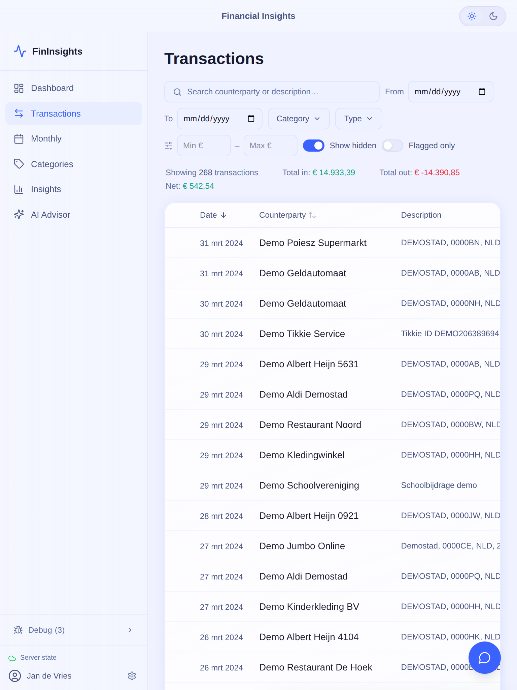 | 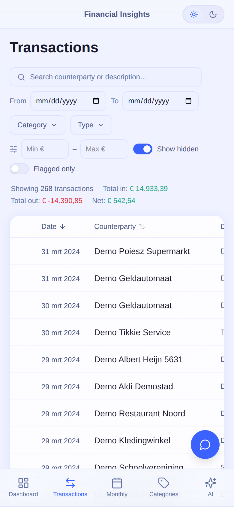 |

---

## Monthly Overview

**Route:** `/monthly`

Detailed breakdown of a single calendar month.

### Navigation
`< March 2024 >` — same month navigator as the dashboard.

### KPI strip
Total Income · Total Expenses · Net Savings, each with a trend vs. the previous month.

### Spending by Category — donut charts
Two donut charts side by side (Income on the left, Expenses on the right), with a ranked list below each showing category name, total, and percentage share.

### Month at a Glance panel
Right-hand summary card showing the delta for Income, Expenses, and Savings vs. the previous month as both a currency value and a percentage change.

| Desktop | Tablet | Phone |
|---|---|---|
| 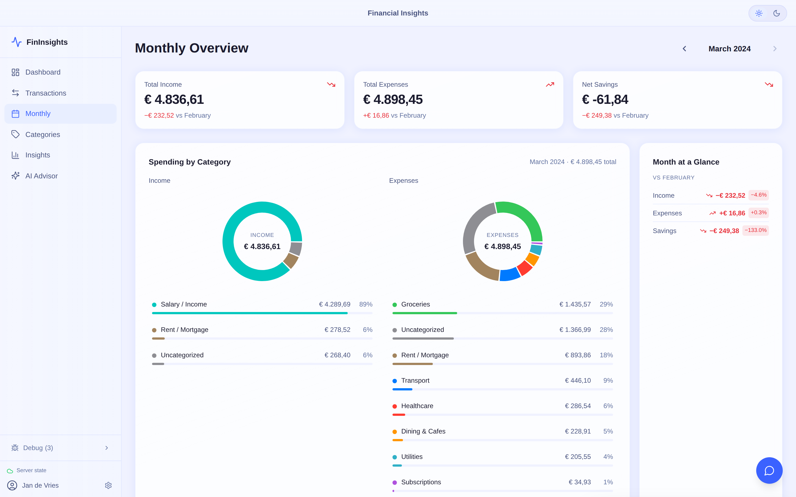 | 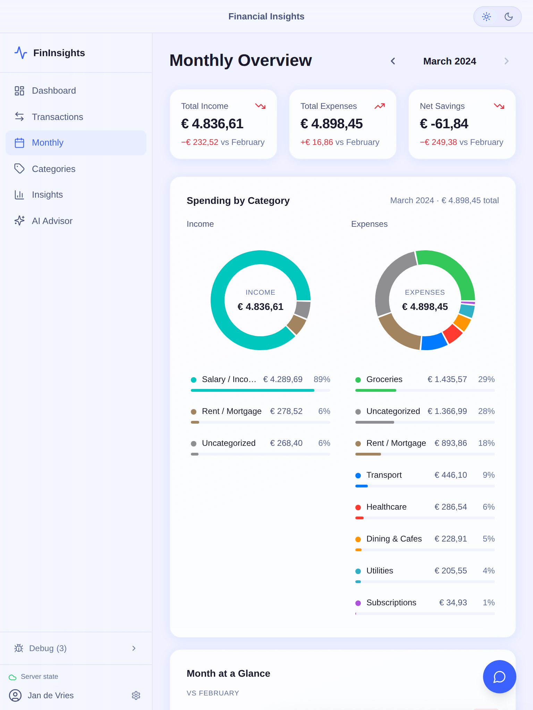 | 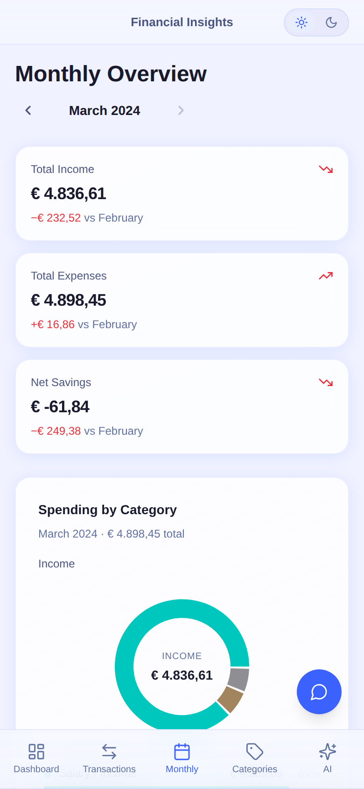 |

---

## Categories

**Route:** `/categories`

Horizontal bar chart of spending by category for the selected month, plus the full category rule editor.

### Spending by Category chart
Each bar represents total spend (absolute value) for one category in the selected month. The month can be changed with the navigator at the top.

### Category Rules
Two-section rule list — **Built-in defaults** (read-only, expandable to inspect conditions) and **Custom rules** (editable, deletable, drag-to-reorder).

Each rule shows its name and the number of matching transactions. Clicking a row expands the condition editor. Custom rules run before built-in defaults; first match wins.

**+ Add rule** button opens a blank rule form at the top of the custom list.

**Categorize with AI** button (requires a configured LLM) sends uncategorized transactions to the AI for bulk classification.

| Desktop | Tablet | Phone |
|---|---|---|
| 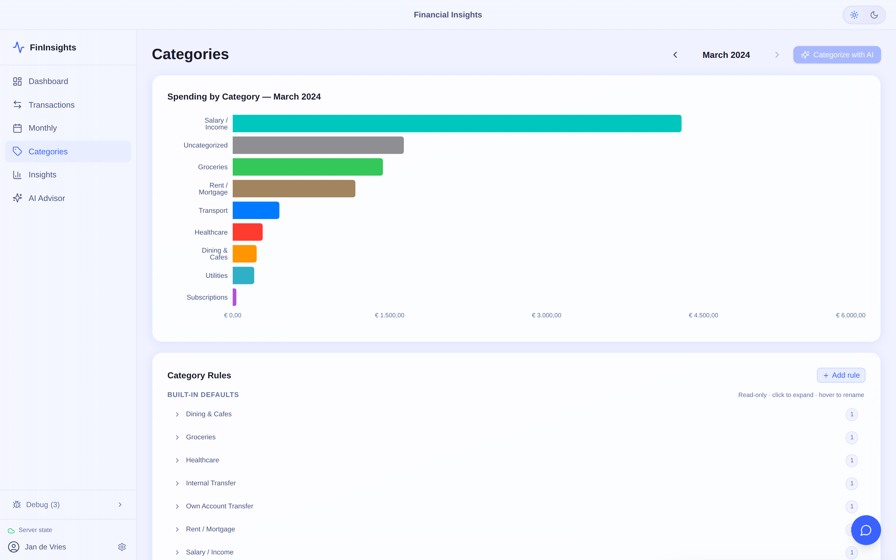 | 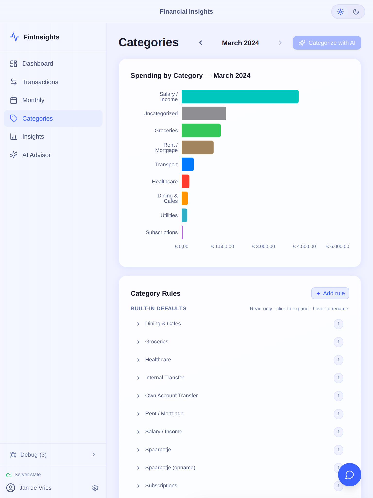 | 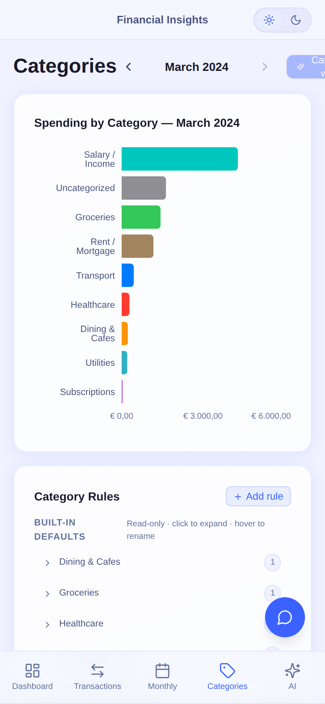 |

---

## Insights

**Route:** `/insights`

Cross-month analytics and anomaly detection. Uses the same `3m · 6m · 12m · All` range selector.

### Anomaly Alerts
Runs a statistical analysis (Z-score + IQR) to find unusual transactions. Click **Run Analysis** to trigger it. Requires the Express server and an optional LLM for plain-language explanations. Results are cached and persist across sessions.

### Top 10 Merchants
Ranked table of counterparties by total spend in the selected period. Columns: Rank · Merchant · Category · Total · Transactions · Average. Clicking a row jumps to the Transactions page filtered to that counterparty.

### Biggest Single Transactions
Two columns — Largest expenses and Largest income — listing the single biggest individual transactions in the period. Clicking a row navigates to and highlights the transaction.

### Monthly Spend Trend per Category
Multi-line chart showing the top 8 spending categories over time. Legend pills are clickable to toggle individual lines.

| Desktop | Tablet | Phone |
|---|---|---|
| 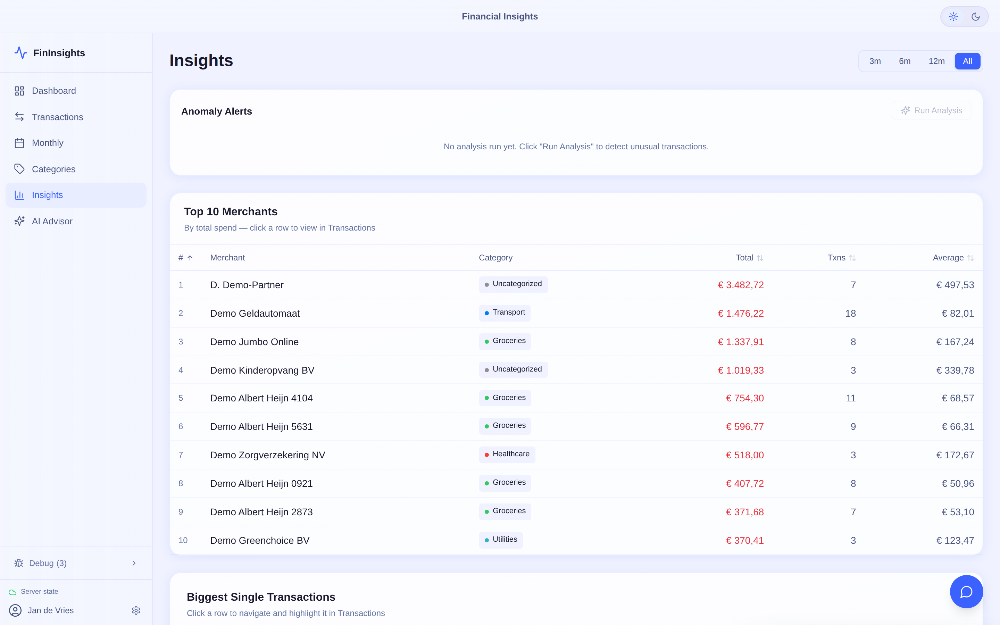 | 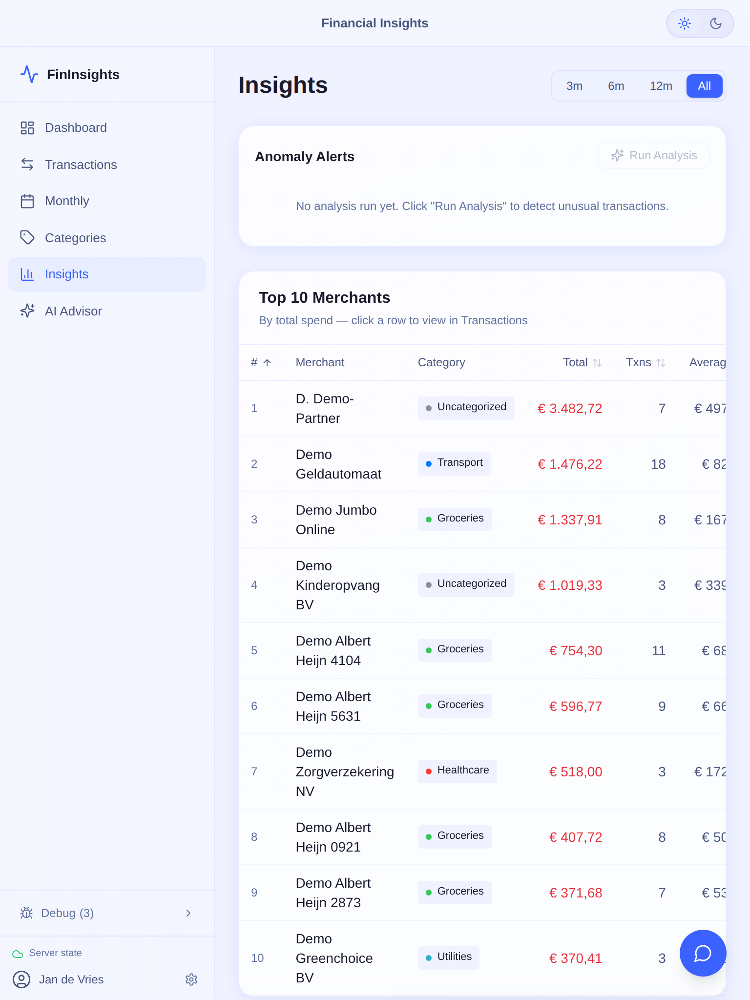 | 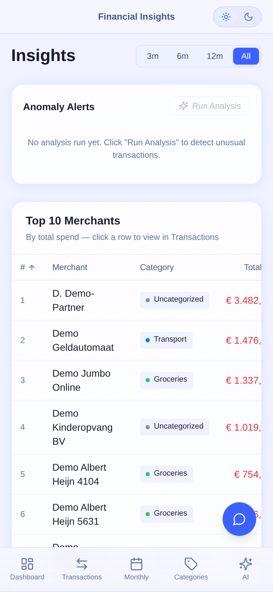 |

---

## AI Advisor

**Route:** `/ai-advisor`

Conversational financial assistant powered by a LangGraph ReAct agent. Requires the Express server and a configured LLM provider (`OPENAI_API_KEY` or `ANTHROPIC_API_KEY` in `.env`).

When AI credentials are not configured, the page shows an "AI Advisor unavailable" placeholder with setup instructions.

### Chat interface
Full-page chat with message history, token-by-token streaming responses, and a text input at the bottom. A trash icon clears the current conversation thread.

### Floating chat panel
A chat bubble in the bottom-right corner (visible on every page) opens a slide-in panel that gives access to the same advisor without leaving the current page.

### Available tools
The agent can call 7 tools to answer questions:
- `getTransactionSummary` — totals for a date range.
- `getTopExpenses` — top N merchants.
- `getCategoryBreakdown` — spending by category.
- `getMonthComparison` — two-month delta.
- `searchTransactions` — full-text search.
- `getAnomalies` — cached anomaly findings.
- `triggerCategorization` — bulk AI categorization.

| Desktop | Tablet | Phone |
|---|---|---|
| 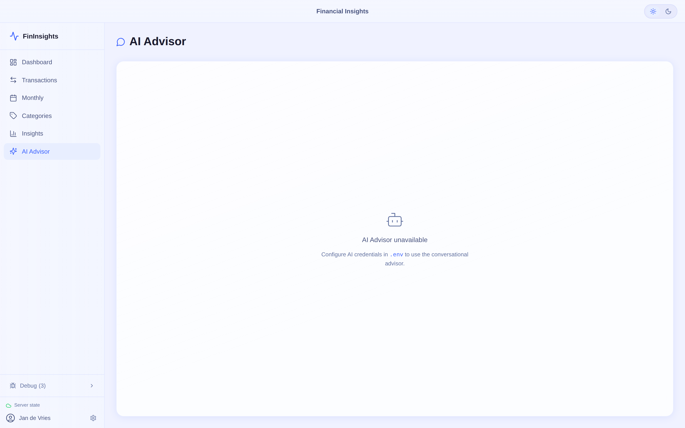 | 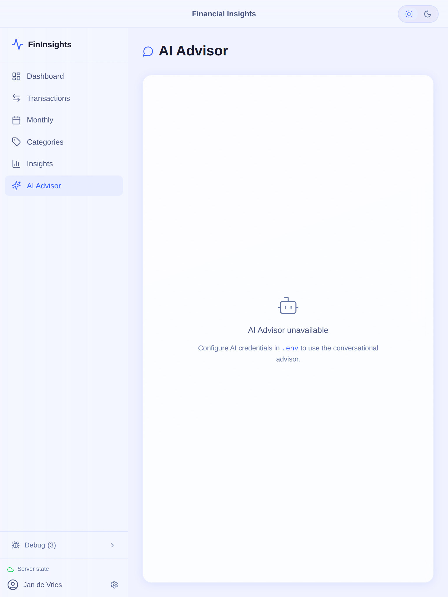 |  |

---

## Settings

**Route:** `/settings`

Application configuration with five sections.

### Spaarpotjes
Create, edit, and delete named savings goals. Each goal has a name, IBAN, and colour. Transfers to/from a registered IBAN are auto-categorized as `spaarpotje` / `spaarpotje-withdrawal` and excluded from income and expense totals.

### Personal Accounts
Register IBANs you own (pocket money, joint accounts, etc.). Transfers to/from these IBANs fall back to the `internal-transfer` category when no other rule matches.

### AI Knowledge Base
URL sources the AI Advisor crawls and indexes for background financial knowledge. Requires the Express server. Each source has a crawl policy (page-only or recursive) and shows crawl progress.

### Data
**Hard CSV refresh** — re-scans the `data/transactions/` folder (prod) or re-parses the compile-time file set (dev) and re-applies all categorization rules.

### Danger Zone
**Reset all settings** — clears all custom rules, category overrides, exclusions, spaarpotjes, and personal accounts, then reloads the page.

| Desktop | Tablet | Phone |
|---|---|---|
| 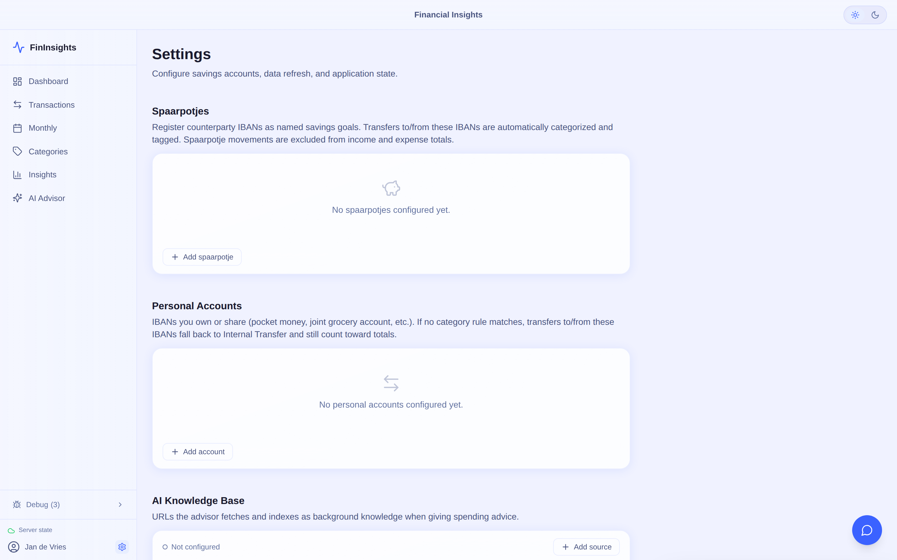 | 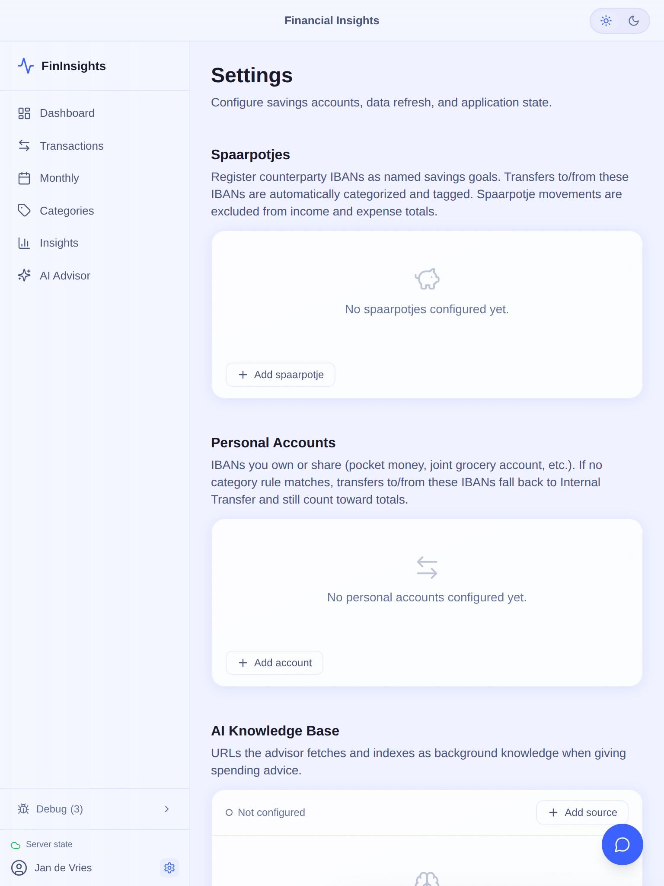 | 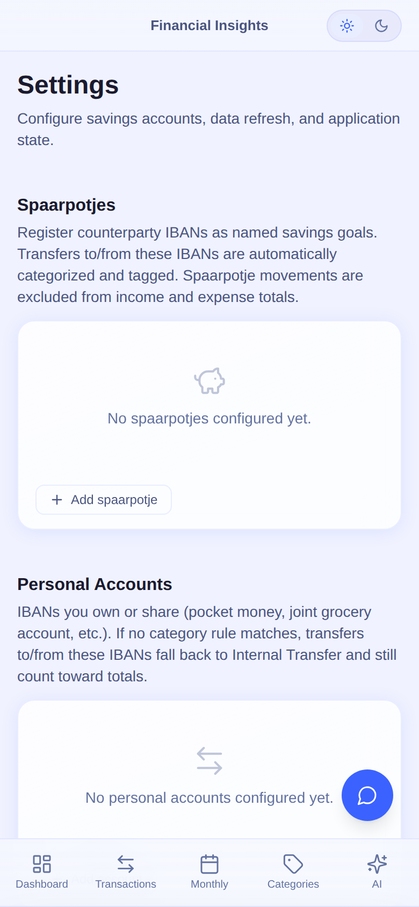 |
